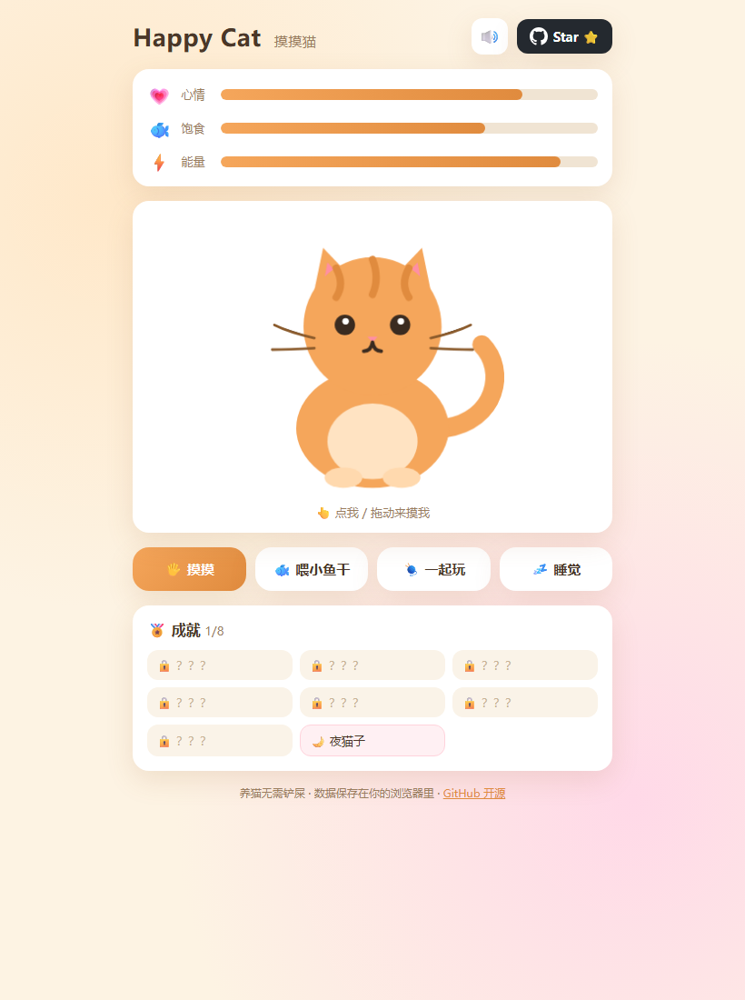

# 🐱 Happy Cat · 摸摸猫

<div align="center">

**一只放在浏览器里的小猫，打开网页就能撸。**

[](LICENSE)
[](https://github.com/zhenmaoge520/happy-cat/stargazers)




</div>

养猫要铲屎，养这个猫只要动动手指。

**Happy Cat** 是一只养在浏览器里的橘猫：摸摸它会呼噜呼噜，饿了会讨小鱼干，没电了会打瞌睡。它记得你，因为它把记忆存在你自己的浏览器里——你走后再回来，它还在等你。

👉 **在线体验：https://zhenmaoge520.github.io/happy-cat/**

---

## ✨ 它会什么？

| 功能 | 说明 |
|------|------|
| 🖐️ **摸摸** | 点击或拖动小猫，它会眯眼、脸红、发出呼噜声 |
| 🐟 **喂小鱼干** | 咔嚓咔嚓，饱食度回升 |
| 🧶 **一起玩** | 追毛线球，心情大涨（但很耗体力） |
| 💤 **睡觉** | 快速回血，Zzz 会从头顶飘出来 |
| 📊 **状态系统** | 心情 / 饱食 / 能量会随时间自然衰减，饿了自己会喊 |
| 🏅 **成就系统** | 8 个隐藏成就等你解锁，包括彩蛋「夜猫子」 |
| 💾 **自动存档** | localStorage 持久化，离线时间也会计入衰减 |
| 🔊 **合成音效** | WebAudio 实时合成的猫叫和呼噜声，零音频文件 |
| ⌨️ **键盘党** | `1` 摸摸 · `2` 喂食 · `3` 玩耍 · `4` 睡觉 |
| 📱 **全端适配** | 手机 / 平板 / 电脑都能玩 |

## 🚀 本地运行

不需要安装任何东西，两种方式任选：

**方式一：直接打开**

双击 `index.html` 即可。

**方式二：本地服务（推荐）**

```bash
git clone https://github.com/zhenmaoge520/happy-cat.git
cd happy-cat
python -m http.server 8080
# 打开 http://localhost:8080
```

## 🛠️ 技术栈

就三样，一个框架都没有：

- HTML —— 一只猫的 SVG
- CSS —— 呼吸、摇尾巴、眨眼、爱心粒子
- JavaScript —— 状态机、存档、WebAudio 音效合成

> 为什么零依赖？因为它值得所有人 clone 下来就能跑，改一行代码就能看到效果。

## 🤝 想让它更可爱？

欢迎 PR！尤其欢迎这些方向：

- 🎨 给猫换毛色（黑猫、布偶、奶牛猫…）
- 🗣️ 增加新的台词
- 🏅 增加新成就
- 🌍 国际化（i18n）
- 🐛 修 bug

步骤：Fork → 新建分支 → 改代码 → 提 PR。就这么简单。

## ⭐ 支持一下

如果这只猫治愈了你，请给它一个 Star —— 那是它的小鱼干。

<div align="center">

**[🐱 在线摸猫](https://zhenmaoge520.github.io/happy-cat/)** · Made with ❤️

</div>

---

## English

**Happy Cat** is a little orange cat living in your browser. Pet it and it purrs, feed it dried fish, play yarn with it — and it remembers you via localStorage.

- **Zero dependencies** — pure HTML / CSS / JavaScript, clone and run
- **Features**: petting with purr sounds (WebAudio synthesized), hunger/mood/energy decay, 8 achievements, autosave, keyboard shortcuts (`1`-`4`), mobile friendly
- **Live demo**: https://zhenmaoge520.github.io/happy-cat/

PRs are welcome (new cat colors, quotes, achievements, i18n...). If it made you smile, a Star is its dried fish. 🐟

## 📄 License

[MIT](LICENSE) © 2026 [zhenmaoge520](https://github.com/zhenmaoge520)
